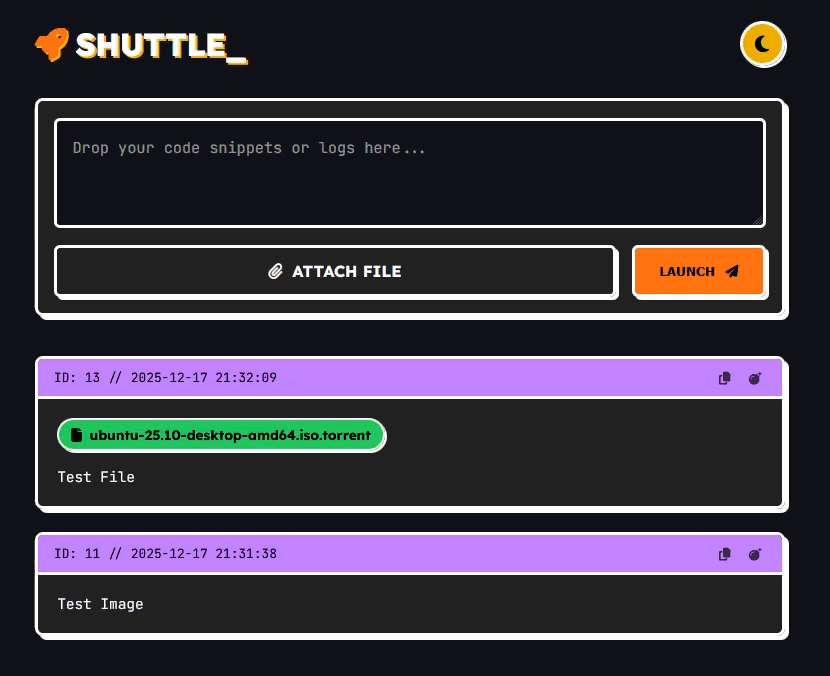

# CodeShuttle 🚀

**CodeShuttle** is a minimalist pastebin and file-sharing web app built with Flask.
It supports code snippets, logs, and file attachments with a modern brutalist-inspired UI and dark/light mode toggle.

---

## Features

* Paste text or upload files
* Copy text to clipboard with one click
* Dark/Light theme toggle with localStorage persistence
* Responsive, brutalist-inspired UI
* File attachments with download links
* SQLite backend for easy local deployment
* Simple Docker deployment

---

## Screenshot



---

## Requirements

* Docker & Docker Compose (recommended)
* Or Python 3.9+ environment

---

## Quick Start with Docker Compose

1. **Clone the repository**

```bash
git clone https://github.com/yourusername/codeshuttle.git
cd codeshuttle
```

2. **Prepare your data folder**

```bash
mkdir -p /home/ghost/ghostsilo/20_Temporary/data/uploads
```

3. **Start the service**

```bash
docker compose up -d
```

4. **Access the app**

Open your browser at [http://localhost:5000](http://localhost:5000)

5. **Stop the service**

```bash
docker compose down
```

---

## Docker Compose Configuration

```yaml
services:
  webapp:
    build:
      context: .
      args:
        - PUID=1000
        - PGID=1000
    container_name: codeshuttle
    ports:
      - "5000:8000"
    environment:
      - DATA_DIR=/app/data
    volumes:
      - /home/ghost/ghostsilo/20_Temporary/:/app/data
    restart: unless-stopped
```

---

## Dockerfile

```dockerfile
FROM python:3.9-slim

WORKDIR /app

ARG PUID=1000
ARG PGID=1000
RUN groupadd -g ${PGID} appgroup && \
    useradd -u ${PUID} -g appgroup -s /bin/sh -m appuser

COPY requirements.txt .
RUN pip install --no-cache-dir -r requirements.txt

COPY . .
RUN chown -R appuser:appgroup /app

USER appuser
EXPOSE 8000

CMD ["gunicorn", "--workers", "2", "--bind", "0.0.0.0:8000", "app:app"]
```

---

## Python Development

1. **Install dependencies**

```bash
pip install -r requirements.txt
```

2. **Run the app locally**

```bash
python app.py
```

3. **Access in browser**

```
http://127.0.0.1:8000
```

---

## Folder Structure

```
.
├── app.py              # Flask application
├── requirements.txt
├── Dockerfile
├── docker-compose.yml
├── templates/
│   └── index.html
├── static/
│   └── (optional CSS/JS)
└── data/
    └── uploads/        # Uploaded files
```

---

## License

MIT License © ghimireaacs

